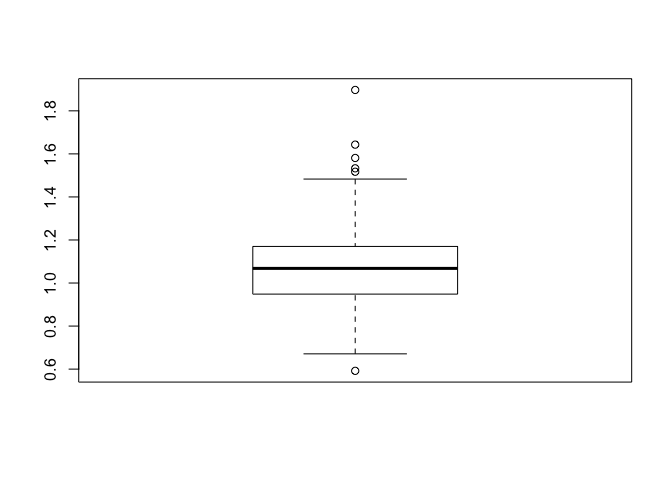
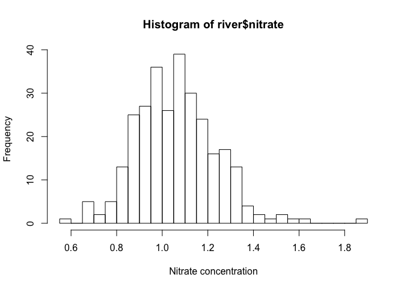
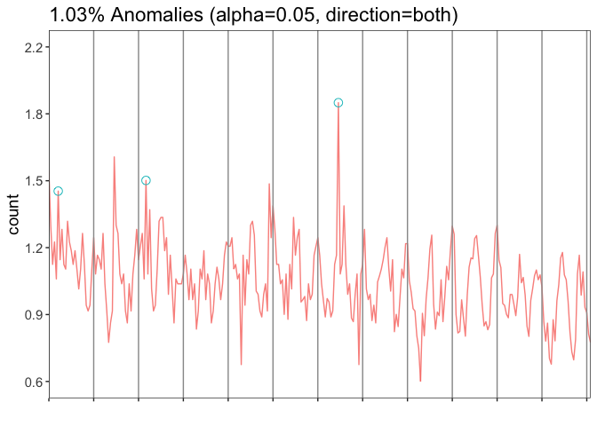

目前没有欺诈的标签，先按照无监督学习做一次看看。

1.  一般无时间纬度，查看箱型图
2.  有时间纬度，查看是否产生一小段连续异常值

先从认识数据开始，把这些图总结出来。

``` r
knitr::opts_chunk$set(warning = FALSE, message = FALSE)
library(data.table)
library(tidyverse)
```

``` r
river <- fread('data/river.csv',drop = 'V1')
```

``` r
# Explore contents of dataset
head(river)
```

    ##    index nitrate   months
    ## 1:     1   1.581  January
    ## 2:     2   1.323 February
    ## 3:     3   1.140    March
    ## 4:     4   1.245    April
    ## 5:     5   1.072      May
    ## 6:     6   1.483     June

``` r
# Summary statistics of river nitrate concentrations
summary(river$nitrate)
```

    ##    Min. 1st Qu.  Median    Mean 3rd Qu.    Max. 
    ##  0.5920  0.9485  1.0680  1.0649  1.1700  1.8970

``` r
# Plot the distribution of nitrate concentration
boxplot(river$nitrate)
```

<!-- -->

<input type="checkbox" id="checkbox1" class="styled">省份数据找下经纬度进行处理

# Grubbs’ test

> Before using Grubbs’ test, you should first check that the
> observations are plausibly normal.

先检验是否符合正太分布，否则不能用 Grubbs 检验

``` r
# Separate the histogram into 40 bins 
hist(river$nitrate, xlab = "Nitrate concentration", breaks = 40)
```

<!-- -->

> Grubbs’ test assesses whether the value that is farthest from the mean
> is an outlier.

``` r
library(outliers)
grubbs.test(river$nitrate)
```

    ## 
    ##  Grubbs test for one outlier
    ## 
    ## data:  river$nitrate
    ## G = 4.72680, U = 0.92269, p-value = 0.000211
    ## alternative hypothesis: highest value 1.897 is an outlier

因此判断 highest value 1.897 is an outlier 为异常值

因此剔除这个值，进行 while loop 直到 p 值在0.05水平之上

<input type="checkbox" id="checkbox1" class="styled">`grubbs.test` 的
while loop

# Seasonal-Hybrid ESD algorithm

时间序列的异常值检测，参考 twitter 的 R包 AnomalyDetection。

> Spot on\! Grubbs’ test can only take an extreme value as a candidate
> for an outlier, while Seasonal-Hybrid ESD explicitly accounts for the
> repeating seasonal patterns. Therefore, it is likely that the extra
> anomalies have been identified as extreme with respect to the seasonal
> pattern in the data.

`AnomalyDetectionVec`函数在原来的GitHub 和 R CRAN 已经失效，我进行了封装也不行，因此是该包的结构有问题。
目前的方法是直接录入函数。

<input type="checkbox" id="checkbox1" class="styled">之后我考虑重新写下这个包

``` r
list.files('AnomalyDetection_func',full.names = T) %>% 
    map(source)
```

``` r
# Run Seasonal-Hybrid ESD for nitrate concentrations
# Use Seasonal-Hybrid ESD for nitrate concentrations
river_anomalies <- AnomalyDetectionVec(x = river$nitrate, period = 12, direction = 'both', plot = T)

# Print the anomalies
river_anomalies$anoms
```

    ##   index anoms
    ## 1     6 1.483
    ## 2    53 1.533
    ## 3   156 1.897

``` r
# Print the plot
print(river_anomalies$plot)
```

<!-- -->

还有更好的选择 ，可以关注这些博客

  - [Anomaly Detection with Wikipedia Page View Data – Beautiful
    Data](http://beautifuldata.net/2015/01/anomaly-detection-with-wikipedia-page-view-data/)
